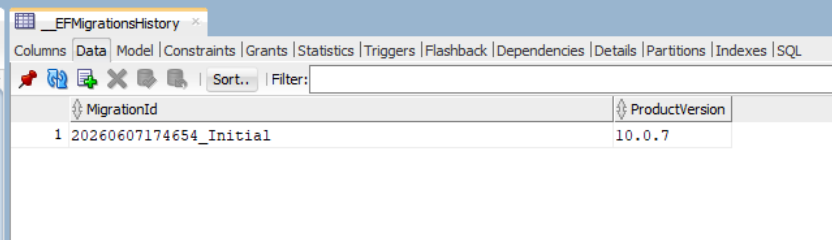
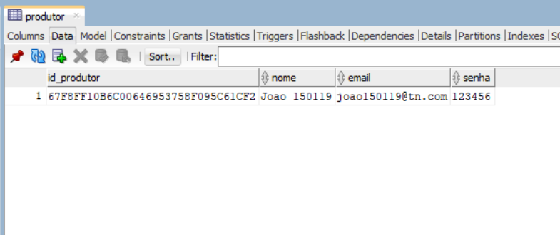
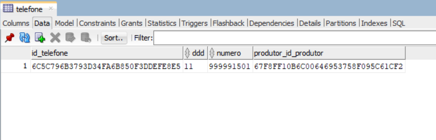
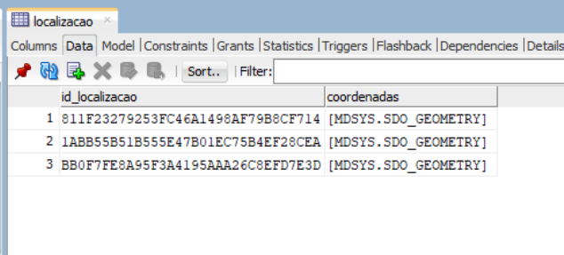
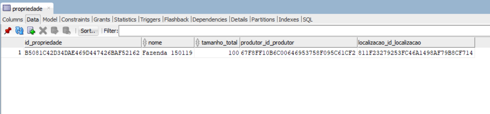
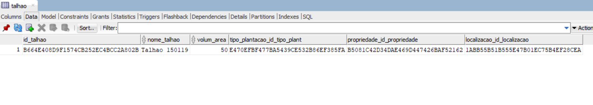
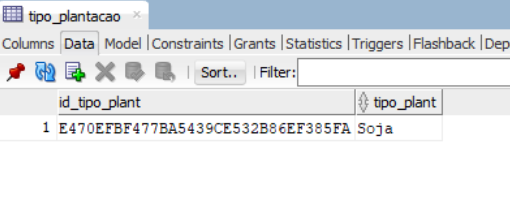
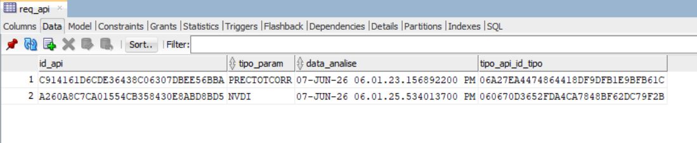
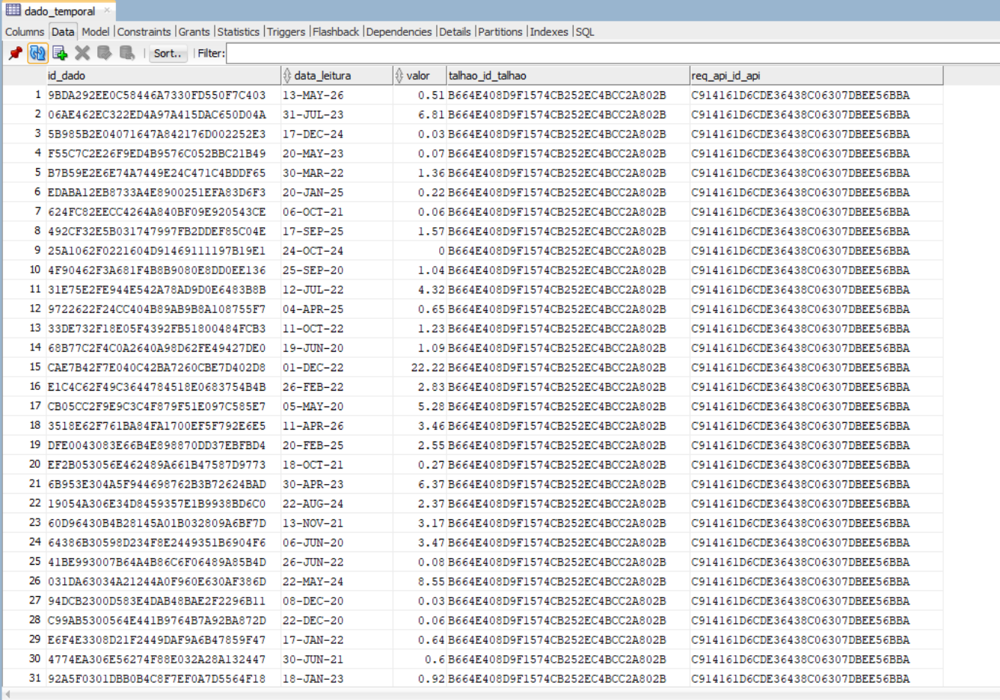
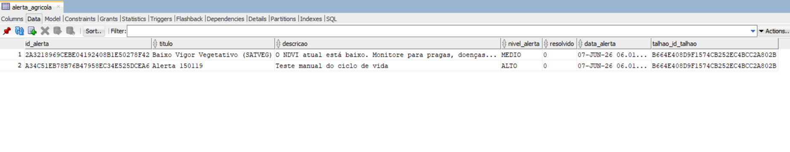

# 🌍 Terra Nova API

> **Global Solution FIAP - Advanced Business Development with .NET**
> 
> API REST em .NET 10 para **monitoramento agrícola inteligente**, focada em centralizar o gerenciamento de propriedades rurais e talhões, coletar e armazenar dados de inteligência climática (NASA POWER) e índices de vegetação (Embrapa SATVeg) por meio de integrações externas, gerando insights e séries temporais georreferenciadas.

---

## 🛠️ Tecnologias & Badges


---

## Repositório Github | Apresentação em Vídeo

[Repositório Github](https://github.com/Global-Solution-Space/Advanced-Business-Development-with-Dot-Net) | [Vídeo de Demonstração Completa](#) | [Vídeo Pitch](#)

---

## 👥 Integrantes

<table>
<tr>
<th>Nome</th>
<th>RM</th>
<th>Turma</th>
<th>GitHub</th>
<th>LinkedIn</th>
</tr>

<tr>
<td>Enzo Okuizumi</td>
<td>561432</td>
<td>2TDSPG</td>
<td><a href="https://github.com/EnzoOkuizumiFiap">EnzoOkuizumiFiap</a></td>
<td><a href="https://www.linkedin.com/in/enzo-okuizumi-b60292256/">Enzo Okuizumi</a></td>
</tr>

<tr>
<td>Lucas Barros Gouveia</td>
<td>566422</td>
<td>2TDSPG</td>
<td><a href="https://github.com/LuzBGouveia">LuzBGouveia</a></td>
<td><a href="https://www.linkedin.com/in/lucas-barros-gouveia-09b147355/">Lucas Barros Gouveia</a></td>
</tr>

<tr>
<td>Milton Marcelino</td>
<td>564836</td>
<td>2TDSPG</td>
<td><a href="https://github.com/MiltonMarcelino">MiltonMarcelino</a></td>
<td><a href="http://linkedin.com/in/milton-marcelino-250298142">Milton Marcelino</a></td>
</tr>

<tr>
<td>Luna de Carvalho Guimarães</td>
<td>562290</td>
<td>2TDSPG</td>
<td><a href="https://github.com/lunaguima">lunaguima</a></td>
<td><a href="https://www.linkedin.com/in/luna-m-guimar%C3%A3es-1850ab173/">Luna M. Guimarães</a></td>
</tr>

<tr>
<td>Gustavo Okada</td>
<td>563428</td>
<td>2TDSPG</td>
<td><a href="https://github.com/Gdev3356">GustavoOkada7268</a></td>
<td><a href="https://www.linkedin.com/in/gustavo-okada-53a3b8359/">Gustavo Okada</a></td>
</tr>

</table>

---

## 🏛️ Arquitetura e Boas Práticas

### Como o projeto está organizado?
A aplicação segue os princípios da **Clean Architecture** (Arquitetura Limpa), dividida em quatro camadas principais:
1. **TerraNova.Domain:** Contém as entidades centrais (`Produtor`, `Talhao`, `Localizacao`), validações de domínio (`DomainException`) e lógicas puras, sem dependência de tecnologia.
2. **TerraNova.Application:** Orquestra os casos de uso. Contém DTOs (Data Transfer Objects), Contratos (Interfaces) de Serviços e Repositórios, blindando o domínio contra alterações na API.
3. **TerraNova.Infrastructure:** Gerencia o acesso a dados (EF Core + Oracle). Implementa o padrão *Repository* e contém as Migrations do banco.
4. **TerraNova.Integration:** Isola os clientes HTTP (`HttpClient`) responsáveis por buscar dados externos — NASA POWER (precipitação) e Embrapa SATVeg (NDVI). Garante que detalhes de integração nunca vazem para camadas superiores.
5. **TerraNova.API:** Camada de apresentação e roteamento (Controllers), injeção de dependências e configuração do Swagger.

### Por que escolheram essa arquitetura?
A Clean Architecture permite o princípio da **Inversão de Dependência**. Se futuramente precisarmos trocar o banco de dados Oracle por PostgreSQL ou substituir a API do SATVeg por outro provedor geoespacial, só precisaremos mexer na camada de **Infrastructure**. O núcleo da regra de negócio (Domain e Application) permanece intacto e perfeitamente isolado.

### Como adicionar uma nova funcionalidade?
O fluxo de desenvolvimento de uma nova funcionalidade seria:
1. **Domain:** Criar/alterar a classe de domínio, garantindo o encapsulamento.
2. **Infrastructure:** Atualizar ou criar o `Configuration.cs` para mapear a tabela no EF Core e gerar uma *Migration*. Implementar o repositório se necessário.
3. **Application:** Criar os DTOs (`Request` e `Response`), a Interface de Serviço e a sua respectiva implementação (caso de uso).
4. **API:** Criar o novo *Controller*, injetar o serviço correspondente e expor as rotas via HTTP, configurando *status codes* (200, 201, 400).

### Padrões de Atualização de Domínio (DDD)
A maioria das entidades segue o padrão **Entity-Behavior** do DDD: possuem um construtor blindado e um método público `Atualizar(...)` que reaproveita as mesmas validações. Entidades imutáveis no contexto de atualização — como `DadoTemporal` e `ReqApi` — não expõem `Atualizar()` porque são criadas uma única vez (via integração externa) e só podem ser removidas em cascata.

Nos Services de aplicação, o fluxo padrão de `Update` é: carregar a entidade existente via `repository.GetById(id)` e invocar `existing.Atualizar(...)`. Isso preserva o `Id`, o estado de tracking do EF Core e evita sobrescrita de campos de auditoria. O `ProdutorService.Update` também segue este padrão para a entidade raiz (`Produtor`), com a distinção de atuar como **Aggregate Root** para o `Telefone`: devido ao ciclo de vida 1:1 atrelado, o serviço orquestra a criação de uma nova instância do telefone e a substitui via `existing.AtribuirTelefone()`, encapsulando a operação (insert ou update) dentro de uma transação atômica via `IUnitOfWork`.

### Transações Atômicas (Unit of Work)
Quando um caso de uso altera **mais de uma entidade** na mesma operação (ex.: `ProdutorService.Create` e `ProdutorService.Update` persistem `Produtor` + `Telefone` simultaneamente), o `Service` envolve as chamadas de repositório em um bloco `IUnitOfWork.ExecuteInTransaction(...)`. Isso garante que todas as tabelas relacionadas sejam commitadas em uma única transação — se qualquer operação falhar, todas sofrem rollback, preservando a consistência do banco.
A infraestrutura fornece:
- `TerraNova.Application.Repositories.IUnitOfWork` — abstração (Clean Architecture)
- `TerraNova.Infrastructure.Persistence.UnitOfWork` — implementação concreta baseada em `TerraNovaContext.Database.BeginTransaction()`

---

## 🗄️ Banco de Dados e Relacionamentos

### Modelagem do Banco de Dados
A modelagem foi concebida utilizando o **Entity Framework Core**, com a abordagem *Code-First*. A grande inovação de viabilidade desta modelagem é o suporte oficial aos **Tipos Geoespaciais (SDO_GEOMETRY)** do Oracle Database usando `NetTopologySuite`.

### Modelo Lógico


### Modelo Relacional


### Relacionamentos Implementados
- **Produtor ↔ Propriedade (1:N):** Um produtor pode possuir várias propriedades, o que nos permite segmentar a visão de gestão agrícola.
- **Produtor ↔ Telefone (1:1):** Cada produtor possui no máximo um telefone detalhado (DDD + número). A FK fica na tabela `Telefone` (`produtor_id_produtor`), garantindo unicidade via índice.
- **Propriedade ↔ Localizacao / Talhao ↔ Localizacao (1:1):** O uso do vínculo `UNIQUE INDEX` na chave estrangeira de `Localizacao` possibilita que cada pedaço de terra e cada talhão de cultura tenham suas coordenadas espaciais georreferenciadas armazenadas isoladamente.
- **Talhao ↔ Propriedade (N:1):** Cada talhão pertence a uma única propriedade, agrupando subdivisões de cultivo dentro de uma mesma fazenda.
- **Talhao ↔ TipoPlantacao (N:1):** Cada talhão possui um tipo de plantação (ex.: Soja, Milho, Café), permitindo classificar e filtrar culturas por tipo.
- **Talhao ↔ DadoTemporal (1:N):** As séries e dados vitais puxados de APIs (como precipitação e índice NDVI) são atrelados fortemente aos talhões para possibilitar gráficos de rendimento.
- **Talhao ↔ AlertaAgricola (1:N):** Alertas agrícolas (automáticos ou manuais) são vinculados diretamente ao talhão que os originou, permitindo rastreamento por área de cultivo.
- **Talhao ↔ ReqApi (1:N):** Um talhão recebe múltiplas solicitações históricas de coletas de telemetria de sensores e satélites externos ao longo do tempo.
- **ReqApi ↔ TipoApi (N:1):** Cada requisição a uma API externa é classificada pelo tipo de API consultada (NASA POWER ou Embrapa SATVeg).
- **ReqApi ↔ DadoTemporal (1:N):** Os dados temporais (séries históricas) são filhos diretos da requisição que os gerou, permitindo rastreabilidade de origem e remoção em cascata.

### O que acontece ao deletar um registro?
Foi implementada a diretiva de deleção em cascata (`DeleteBehavior.Cascade`) para dados dependentes diretos. Por exemplo, ao deletar um `Talhao`, todos os seus respectivos `AlertaAgricola` e `DadoTemporal` são varridos automaticamente, garantindo que não haja registros órfãos no banco. Associações mais estruturais (como `Propriedade` e `Localizacao`) usam `Restrict` para impedir deleções acidentais na integridade do território.

---

## 🗂️ Migrations e Evolução

### O que são migrations e qual o papel delas?
*Migrations* são scripts evolutivos gerados pelo EF Core que versionam o banco de dados via código C#. Em vez de escrevermos `CREATE TABLE` manualmente em SQL, nós estruturamos o estado do sistema na camada de infraestrutura e o EF calcula as diferenças.

### Como gerenciar mudanças ao longo do tempo?
Toda alteração de banco deve passar pelo fluxo:
1. Edição da Entidade ou de sua classe `Configuration.cs`.
2. Execução de `dotnet ef migrations add NomeDaAlteracao`.
3. Execução de `dotnet ef database update` para aplicar no Oracle.

*Nota de destaque:* O EF Core gerencia a tabela `__EFMigrationsHistory`. A criação de metadados espaciais (`USER_SDO_GEOM_METADATA`) e do índice espacial (`MDSYS.SPATIAL_INDEX_V2`) exige privilégios de DBA no Oracle e deve ser executada manualmente pelo administrador do banco. O mapeamento da coluna `SDO_GEOMETRY` é feito via `NetTopologySuite`, com SRID 4326 (WGS 84).

---

## 🚦 Tratamento de Entradas Inválidas e Testes

### Como a aplicação trata entradas inválidas?
O projeto utiliza um pipeline duplo de validação:
1. **Validação de Sintaxe e Limites (DTOs):** Os Requests (como `LocalizacaoRequest.cs`) utilizam anotações do tipo `[Range(-90.0, 90.0)]` e `[Required]`. Se violado, o ASP.NET Core automaticamente interrompe o fluxo e retorna um `400 Bad Request` sem nem encostar no serviço.
2. **Validação de Negócio (Domain):** Entidades como `Localizacao` não têm *setters* abertos. Eles são inicializados por construtores blindados que jogam uma `DomainException` caso alguém tente cadastrar uma coordenada geograficamente impossível.
3. **Unicidade de Contato:** O telefone do produtor é tratado como contato 1:1. O campo `telefoneContato` em `ProdutorRequest` cria ou atualiza o telefone principal, e a combinação `DDD + número` é bloqueada para duplicidade tanto no cadastro de produtor quanto em `POST/PUT /api/telefone`.

### Testes da API (Insomnia / Swagger)
As rotas da API foram intensamente testadas. Graças à blindagem no DTO (`LocalizacaoRequest`), a nossa API recebe os campos JSON normais `latitude` e `longitude` enviados por clientes externos, e o nosso Mapper converte isso para um Ponto Geoespacial (`NetTopologySuite.Point`) transparente para o banco de dados, sem o consumidor (Frontend/Mobile) precisar saber WKT.
O teste final pode ser realizado rodando a API e acessando o `http://localhost:5160/index.html` gerado para realizar inserts nos endpoints.

---

## 🚀 Como Executar o Projeto

1. **Configuração de Secrets (Banco Oracle FIAP e SATveg):**
   No terminal, na raiz do projeto `TerraNova\TerraNova.API`, rode para armazenar suas credenciais com segurança:
   ```powershell
   cd TerraNova\TerraNova.API
   dotnet user-secrets init
   dotnet user-secrets set "ConnectionStrings:TerraNovaOracle" "User Id=RMxxxxxx;Password=xxxxxx;Data Source=oracle.fiap.com.br:1521/orcl;"

   Crie o arquivo `.env` e informe o token do SatVeg:
   "SATVEG_API_TOKEN=Bearer e97dab05-eedc-39b9-a3fd-fa83cb5fef5e"
   ```

2. **Atualização do Banco de Dados (Gerar tabelas e schemas espaciais):**
   ```powershell
   dotnet ef database update --project .\TerraNova.Infrastructure --startup-project .\TerraNova.API
   ```

3. **Execução Local:**
   ```powershell
   dotnet run --project .\TerraNova\TerraNova.API
   ```
   Acesse a URL (ex: `http://localhost:5160/index.html`) fornecida no terminal para visualizar os endpoints ativos e testar a aplicação de ponta a ponta.

---

## 📌 Documentação de Rotas (Endpoints Atuais)

> As rotas podem ser integralmente visualizadas e operadas na UI do **Swagger**. Segue estrutura base de rotas operacionais (CRUD e integrações):

### Produtores
| Método | Rota | Descrição |
|--------|------|-----------|
| GET | `/api/produtor` | Listar todos os produtores |
| GET | `/api/produtor/{id}` | Buscar produtor por ID |
| GET | `/api/produtor/by-email` | Buscar produtor pelo seu e-mail |
| POST | `/api/produtor` | Cadastrar novo produtor |
| PUT | `/api/produtor/{id}` | Atualizar dados do produtor (nome, e-mail, senha) |
| DELETE | `/api/produtor/{id}` | Remover um produtor |

### Propriedades
| Método | Rota | Descrição |
|--------|------|-----------|
| GET | `/api/propriedade` | Listar propriedades gerenciadas |
| GET | `/api/propriedade/{id}` | Buscar propriedade por ID |
| GET | `/api/propriedade/by-produtor/{produtorId}` | Listar propriedades vinculadas a um produtor |
| POST | `/api/propriedade` | Cadastrar propriedade vinculando localidade espacial |
| PUT | `/api/propriedade/{id}` | Atualizar propriedade (nome, tamanho, produtor, localização) |
| DELETE | `/api/propriedade/{id}` | Remover uma propriedade |

### Gestão Talhão
| Método | Rota | Descrição |
|--------|------|-----------|
| GET | `/api/talhao` | Listar talhões cadastrados e suas métricas |
| GET | `/api/talhao/{id}` | Buscar talhão por ID |
| GET | `/api/talhao/by-propriedade/{propriedadeId}` | Listar talhões vinculados a uma propriedade |
| GET | `/api/talhao/by-tipo-plantacao/{tipoPlantacaoId}` | Listar talhões filtrados por tipo de cultura agrícola |
| POST | `/api/talhao` | Cadastrar novo talhão e cultura (`TipoPlantacao`) |
| PUT | `/api/talhao/{id}` | Atualizar talhão (nome, área, tipo de plantação, propriedade, localização) |
| DELETE | `/api/talhao/{id}` | Remover um talhão |

### Gestão Tipos de Plantação

| Método     | Rota                      | Descrição                             |
| --------- | ------------------------- | -------------------------------------- |
| `GET`     | `/api/tipoplantacao`      | Lista todos os tipos de plantação      |
| `GET`     | `/api/tipoplantacao/{id}` | Busca tipo de plantação por ID         |
| `POST`    | `/api/tipoplantacao`      | Cria um tipo de plantação              |
| `PUT`     | `/api/tipoplantacao/{id}` | Atualiza um tipo de plantação          |
| `DELETE`  | `/api/tipoplantacao/{id}` | Remove um tipo de plantação            |

### Dados Espaciais & Localização
| Método | Rota | Descrição |
|--------|------|-----------|
| GET | `/api/localizacao` | Listar entidades espaciais e coordenadas georreferenciadas |
| GET | `/api/localizacao/{id}` | Buscar uma localização espacial por ID |
| POST | `/api/localizacao` | Cadastrar nova coordenada (WGS 84 Point) |
| PUT | `/api/localizacao/{id}` | Atualizar coordenadas geográficas (latitude/longitude) |
| DELETE | `/api/localizacao/{id}` | Remover um registro espacial |

### Comunicação (Telefones)
| Método | Rota | Descrição |
|--------|------|-----------|
| GET | `/api/telefone` | Listar todos os telefones de produtores |
| GET | `/api/telefone/{id}` | Buscar telefone por ID |
| GET | `/api/telefone/by-produtor/{produtorId}` | Buscar o telefone associado a um produtor específico |
| POST | `/api/telefone` | Cadastrar novo contato telefônico, desde que o produtor ainda não possua telefone e o `DDD + número` não exista |
| PUT | `/api/telefone/{id}` | Atualizar DDD e número do telefone, mantendo o vínculo com o produtor e rejeitando `DDD + número` já usado por outro telefone |
| DELETE | `/api/telefone/{id}` | Remover registro de telefone |

> Também é possível manter o telefone principal pelo fluxo de produtor: `POST /api/produtor` e `PUT /api/produtor/{id}` recebem `telefoneContato` com DDD e número, com ou sem máscara.

### Requisições de API Externa (Integrações)

A integração com APIs externas (NASA POWER e Embrapa SATVeg) é realizada de forma **assíncrona** via `async/await` (Controller → Service → HttpClient), garantindo alta performance sem bloquear threads do Kestrel. Ao chamar o endpoint de criação, o sistema:

1. Valida o TipoApi e Talhão
2. Cria o cabeçalho `ReqApi`
3. Chama a API externa (NASA ou SATVeg) usando coordenadas do Talhão
4. Filtra dados inválidos (sensor com defeito NASA `<= -900`, datas SATVEG `>= 2020-01-01`)
5. Persiste `DadoTemporal` em lote
6. **Gera alertas automáticos** baseados em thresholds de negócio

| Método | Rota | Descrição |
|--------|------|-----------|
| GET | `/api/reqapi` | Lista requisições (com contagem de dados otimizada via `COUNT` no banco) |
| GET | `/api/reqapi/{id}` | Busca requisição por ID (com contagem de dados) |
| GET | `/api/reqapi/talhao/{idTalhao}` | Lista requisições de um talhão via `EXISTS` otimizado (`.Any()`) |
| POST | `/api/reqapi` | **Async** - Executa integração e persiste dados + alertas |
| DELETE | `/api/reqapi/{id}` | Remove requisição |

**Compatibilidade de parâmetros de integração:**
| API Externa | `tipoParam` (enum) | Valor JSON |
| --- | --- | --- |
| `NASAPOWER` | `PRECTOTCORR` (chuva) | `1` |
| `SATVEG` | `NDVI` (vegetação) | `0` |

**Thresholds de Alerta Automático:**
| API | Condição | Nível | Título |
| --- | --- | --- | --- |
| NASA | Chuva 3 dias > 80mm | Alto | Risco de Alagamento |
| NASA | Chuva 15 dias < 10mm | Crítico | Seca Severa |
| NASA | Chuva 15 dias < 25mm | Médio | Estresse Hídrico |
| SATVEG | NDVI < 0.2 | Crítico | Anomalia Vegetativa Severa |
| SATVEG | NDVI < 0.4 | Médio | Baixo Vigor Vegetativo |

### Dados Temporais
| Método | Rota | Descrição |
|--------|------|-----------|
| GET | `/api/dadostemporal` | Lista todos os dados temporais armazenados |
| GET | `/api/dadostemporal/{id}` | Busca dado temporal por ID |
| GET | `/api/dadostemporal/talhao/{talhaoId}` | Lista dados temporais filtrados por talhão |
| GET | `/api/dadostemporal/req-api/{reqApiId}` | Lista dados temporais gerados por uma requisição específica |

### Alertas Agrícolas

Sistema de alertas reativos com **deduplicação automática**: não cria alertas duplicados para o mesmo talhão + mesmo título enquanto não resolvido.

| Método | Rota | Descrição |
|--------|------|-----------|
| GET | `/api/alertaagricola` | Lista todos os alertas |
| GET | `/api/alertaagricola/{id}` | Busca alerta por ID |
| GET | `/api/alertaagricola/talhao/{talhaoId}` | Lista alertas de um talhão |
| POST | `/api/alertaagricola` | Cria alerta manual |
| PUT | `/api/alertaagricola/{id}` | Atualiza alerta (título, descrição, nível) |
| PATCH | `/api/alertaagricola/{id}/resolver` | Marca alerta como resolvido |
| PATCH | `/api/alertaagricola/{id}/reabrir` | Reabre alerta resolvido |
| DELETE | `/api/alertaagricola/{id}` | Remove alerta |

**Regras de Deduplicação:** Não permite alerta ativo (`resolvido = false`) com mesmo `titulo` para o mesmo `talhaoId`.


## Imagens Tabelas Banco de Dados

### EFMigration



### produtor



### telefone



### localizacao



### propriedade 



### talhao



### tipo_plantacao



### req_api



### dado_temporal



### alerta_agricola



# 🧪 Comandos CRUD

Abaixo estão os comandos `curl` para exercitar a API após o `docker compose up -d --build` estar rodando. A API expõe os endpoints no prefixo `api/` e a interface interativa do Swagger está disponível em `http://localhost:8080/index.html`.

> 🔁 **Ordem recomendada**: como as entidades possuem chaves estrangeiras entre si, cadastre primeiro as entidades que não precisam de IDs anteriores e vá avançando. Os exemplos abaixo usam `jq` para capturar o `id` retornado em cada `CREATE` e reutilizar esse valor automaticamente nos comandos seguintes.

> Caso esteja rodando localmente:
```bash
API_URL="http://localhost:5160/"
```

> Caso esteja rodando no Docker:
```bash
API_URL="http://localhost:8080/"
```

## 1️⃣ Criar um Tipo de Plantação (sem ID anterior)

```bash
# CREATE
TIPO_PLANTACAO_ID=$(curl -fsS -X POST "$API_URL/api/tipoplantacao" \
  -H "Content-Type: application/json" \
  -d '{
    "tipoPlant": "Soja"
  }' | jq -r '.id // .Id')

echo "TIPO_PLANTACAO_ID=$TIPO_PLANTACAO_ID"

# READ ALL
curl -fsS "$API_URL/api/tipoplantacao"

# READ BY ID
curl -fsS "$API_URL/api/tipoplantacao/$TIPO_PLANTACAO_ID"

# UPDATE
curl -fsS -X PUT "$API_URL/api/tipoplantacao/$TIPO_PLANTACAO_ID" \
  -H "Content-Type: application/json" \
  -d '{
    "tipoPlant": "Soja Transgênica"
  }'

```

## 2️⃣ Criar uma Localização (sem ID anterior)

```bash
# CREATE
LOCALIZACAO_ID=$(curl -fsS -X POST "$API_URL/api/localizacao" \
  -H "Content-Type: application/json" \
  -d '{
    "latitude":  -23.5505,
    "longitude": -46.6333
  }' | jq -r '.id // .Id')

echo "LOCALIZACAO_ID=$LOCALIZACAO_ID"

# READ ALL
curl -fsS "$API_URL/api/localizacao"

# READ BY ID
curl -fsS "$API_URL/api/localizacao/$LOCALIZACAO_ID"

# UPDATE
curl -fsS -X PUT "$API_URL/api/localizacao/$LOCALIZACAO_ID" \
  -H "Content-Type: application/json" \
  -d '{
    "latitude":  -22.9068,
    "longitude": -43.1729
  }'

```

## 3️⃣ Criar um Produtor (sem ID anterior; já cadastra o telefone)

```bash
# CREATE (cadastra produtor + telefone na mesma chamada)
PRODUTOR_ID=$(curl -fsS -X POST "$API_URL/api/produtor" \
  -H "Content-Type: application/json" \
  -d '{
    "nome":   "João da Silva",
    "email":  "joao.silva@terranova.com",
    "senha":  "senha123",
    "telefoneContato": "11987654321"
  }' | jq -r '.id // .Id')

echo "PRODUTOR_ID=$PRODUTOR_ID"

# READ ALL
curl -fsS "$API_URL/api/produtor"

# READ BY ID
curl -fsS "$API_URL/api/produtor/$PRODUTOR_ID"

# READ BY EMAIL
curl -fsS "$API_URL/api/produtor/by-email?email=joao.silva@terranova.com"

# UPDATE
curl -fsS -X PUT "$API_URL/api/produtor/$PRODUTOR_ID" \
  -H "Content-Type: application/json" \
  -d '{
    "nome":   "João da Silva Jr.",
    "email":  "joao.jr@terranova.com",
    "senha":  "novaSenha123",
    "telefoneContato": "11999998888"
  }'

```

## 4️⃣ Criar uma Propriedade (requer ID de Produtor + Localização)

```bash
# CREATE
PROPRIEDADE_ID=$(curl -fsS -X POST "$API_URL/api/propriedade" \
  -H "Content-Type: application/json" \
  -d "$(jq -n \
    --arg produtorId "$PRODUTOR_ID" \
    --arg localizacaoId "$LOCALIZACAO_ID" \
    '{
      nome: "Fazenda Boa Vista",
      tamanhoTotal: 150.75,
      produtorId: $produtorId,
      localizacaoId: $localizacaoId
    }')" | jq -r '.id // .Id')

echo "PROPRIEDADE_ID=$PROPRIEDADE_ID"

# READ ALL
curl -fsS "$API_URL/api/propriedade"

# READ BY ID
curl -fsS "$API_URL/api/propriedade/$PROPRIEDADE_ID"

# READ BY PRODUTOR
curl -fsS "$API_URL/api/propriedade/by-produtor/$PRODUTOR_ID"

# UPDATE
curl -fsS -X PUT "$API_URL/api/propriedade/$PROPRIEDADE_ID" \
  -H "Content-Type: application/json" \
  -d "$(jq -n \
    --arg produtorId "$PRODUTOR_ID" \
    --arg localizacaoId "$LOCALIZACAO_ID" \
    '{
      nome: "Fazenda Boa Vista - Sede",
      tamanhoTotal: 175.00,
      produtorId: $produtorId,
      localizacaoId: $localizacaoId
    }')"

```

## 5️⃣ Criar um Talhão (requer ID de TipoPlantação + Propriedade + Localização)

```bash
# CREATE
TALHAO_ID=$(curl -fsS -X POST "$API_URL/api/talhao" \
  -H "Content-Type: application/json" \
  -d "$(jq -n \
    --arg tipoPlantacaoId "$TIPO_PLANTACAO_ID" \
    --arg propriedadeId "$PROPRIEDADE_ID" \
    --arg localizacaoId "$LOCALIZACAO_ID" \
    '{
      nomeTalhao: "Talhão 01 - Soja",
      volumArea: 45.50,
      tipoPlantacaoId: $tipoPlantacaoId,
      propriedadeId: $propriedadeId,
      localizacaoId: $localizacaoId
    }')" | jq -r '.id // .Id')

echo "TALHAO_ID=$TALHAO_ID"

# READ ALL
curl -fsS "$API_URL/api/talhao"

# READ BY ID
curl -fsS "$API_URL/api/talhao/$TALHAO_ID"

# READ BY PROPRIEDADE
curl -fsS "$API_URL/api/talhao/by-propriedade/$PROPRIEDADE_ID"

# READ BY TIPO PLANTACAO
curl -fsS "$API_URL/api/talhao/by-tipo-plantacao/$TIPO_PLANTACAO_ID"

# UPDATE
curl -fsS -X PUT "$API_URL/api/talhao/$TALHAO_ID" \
  -H "Content-Type: application/json" \
  -d "$(jq -n \
    --arg tipoPlantacaoId "$TIPO_PLANTACAO_ID" \
    --arg propriedadeId "$PROPRIEDADE_ID" \
    --arg localizacaoId "$LOCALIZACAO_ID" \
    '{
      nomeTalhao: "Talhão 01 - Soja (Renomeado)",
      volumArea: 50.00,
      tipoPlantacaoId: $tipoPlantacaoId,
      propriedadeId: $propriedadeId,
      localizacaoId: $localizacaoId
    }')"

```

## 7️⃣ Criar um Tipo de API (sem ID anterior)

```bash
# CREATE
TIPO_API_ID=$(curl -fsS -X POST "$API_URL/api/tipoapi" \
  -H "Content-Type: application/json" \
  -d '{
    "nomeTipoApi": "NASA POWER"
  }' | jq -r '.id // .Id')

echo "TIPO_API_ID=$TIPO_API_ID"

# READ ALL
curl -fsS "$API_URL/api/tipoapi"

# READ BY ID
curl -fsS "$API_URL/api/tipoapi/$TIPO_API_ID"

# UPDATE
curl -fsS -X PUT "$API_URL/api/tipoapi/$TIPO_API_ID" \
  -H "Content-Type: application/json" \
  -d '{
    "nomeTipoApi": "NASA POWER"
  }'
```

## 8️⃣ Criar uma Requisição de API (requer ID de Tipo API + Talhão)

```bash
# CREATE
# tipoParam: 0 = NDVI/SATVEG, 1 = PRECTOTCORR/NASA POWER
REQ_API_ID=$(curl -fsS -X POST "$API_URL/api/reqapi" \
  -H "Content-Type: application/json" \
  -d "$(jq -n \
    --arg tipoApiId "$TIPO_API_ID" \
    --arg talhaoId "$TALHAO_ID" \
    '{
      tipoParam: 1,
      tipoApiId: $tipoApiId,
      talhaoId: $talhaoId
    }')" | jq -r '.id // .Id')

echo "REQ_API_ID=$REQ_API_ID"

# READ ALL
curl -fsS "$API_URL/api/reqapi"

# READ BY ID
curl -fsS "$API_URL/api/reqapi/$REQ_API_ID"

# READ BY TALHÃO
curl -fsS "$API_URL/api/reqapi/talhao/$TALHAO_ID"
```

## 9️⃣ Criar um Alerta Agrícola (requer ID de Talhão)

```bash
# CREATE
# nivelAlerta: 0 = Baixo, 1 = Medio, 2 = Alto, 3 = Critico
ALERTA_ID=$(curl -fsS -X POST "$API_URL/api/alertaagricola" \
  -H "Content-Type: application/json" \
  -d "$(jq -n \
    --arg talhaoId "$TALHAO_ID" \
    '{
      titulo: "Risco de estiagem",
      descricao: "Monitorar baixa umidade e necessidade de irrigação no talhão.",
      nivelAlerta: 2,
      talhaoId: $talhaoId
    }')" | jq -r '.id // .Id')

echo "ALERTA_ID=$ALERTA_ID"

# READ ALL
curl -fsS "$API_URL/api/alertaagricola"

# READ BY ID
curl -fsS "$API_URL/api/alertaagricola/$ALERTA_ID"

# READ BY TALHÃO
curl -fsS "$API_URL/api/alertaagricola/talhao/$TALHAO_ID"

# UPDATE
curl -fsS -X PUT "$API_URL/api/alertaagricola/$ALERTA_ID" \
  -H "Content-Type: application/json" \
  -d "$(jq -n \
    --arg talhaoId "$TALHAO_ID" \
    '{
      titulo: "Risco de estiagem atualizado",
      descricao: "Acompanhar chuva acumulada e revisar planejamento de irrigação.",
      nivelAlerta: 3,
      talhaoId: $talhaoId
    }')"

# RESOLVER
curl -fsS -X PATCH "$API_URL/api/alertaagricola/$ALERTA_ID/resolver"

# REABRIR
curl -fsS -X PATCH "$API_URL/api/alertaagricola/$ALERTA_ID/reabrir"
```

## 🔟 Consultar Dados Temporais (gerados pela Req API)

```bash
# READ ALL
curl -fsS "$API_URL/api/dadotemporal"

# READ BY TALHÃO
curl -fsS "$API_URL/api/dadotemporal/talhao/$TALHAO_ID"

# READ BY REQ API
curl -fsS "$API_URL/api/dadotemporal/req-api/$REQ_API_ID"

# READ BY ID
DADO_TEMPORAL_ID=$(curl -fsS "$API_URL/api/dadotemporal/req-api/$REQ_API_ID" | jq -r '.[0].id // .[0].Id // empty')

if [ -n "$DADO_TEMPORAL_ID" ]; then
  curl -fsS "$API_URL/api/dadotemporal/$DADO_TEMPORAL_ID"
else
  echo "Nenhum dado temporal retornado para a requisição $REQ_API_ID"
fi
```

> ℹ️ `DadoTemporal` não possui `POST`, `PUT` ou `DELETE` próprios no controller. Os registros são criados automaticamente ao executar `POST /api/reqapi` e são removidos em cascata ao remover a requisição correspondente.

## 🧹 Remover os registros criados (ordem segura para DELETE)

```bash
# DELETE ALERTA AGRÍCOLA
curl -fsS -X DELETE "$API_URL/api/alertaagricola/$ALERTA_ID"

# DELETE REQ API (remove os dados temporais associados)
curl -fsS -X DELETE "$API_URL/api/reqapi/$REQ_API_ID"

# DELETE TIPO API
curl -fsS -X DELETE "$API_URL/api/tipoapi/$TIPO_API_ID"

# DELETE TALHÃO
curl -fsS -X DELETE "$API_URL/api/talhao/$TALHAO_ID"

# DELETE PROPRIEDADE
curl -fsS -X DELETE "$API_URL/api/propriedade/$PROPRIEDADE_ID"

# DELETE PRODUTOR
curl -fsS -X DELETE "$API_URL/api/produtor/$PRODUTOR_ID"

# DELETE LOCALIZAÇÃO
curl -fsS -X DELETE "$API_URL/api/localizacao/$LOCALIZACAO_ID"

# DELETE TIPO DE PLANTAÇÃO
curl -fsS -X DELETE "$API_URL/api/tipoplantacao/$TIPO_PLANTACAO_ID"